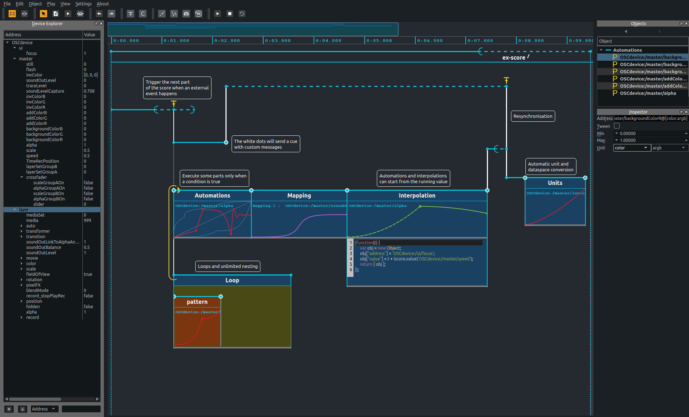

# Introduction

Score is an interactive sequencer for intermedia creation. It allows to create flexible and interactive scenarios and is especially designed for live performance, art installation, museography or any context requiring a precise and interactive execution of timed events.

Score brings a flexible solution to the managment and execution of events and their evolution in time. Modern DAWs now offer a number of tools to write precise automations along a timeline. However, as powerful as these are in the context of fixed-time media, such solutions are of little help when introducing interactivity in the execution of produced scenarios. On the other hand, a number of softwares allows to trigger events in an interactive way, through a cue-based paradigm. However, these may not offer automation facilities as advanced as those found in modern DAW and also often rely on a sequential and linear triggering of events.

Score brings these two approaches in a unified timeline. Scenario authoring and execution in Score thus makes possible to write fixed-timed automations as well as sequences of automations triggered interactively. Most importantly, these two paradigms can be combined and used in parallel or hierarchically and provide the high level of control as well as openess required by today’s creation.

## A sequencer for distributed media systems

Unlike other digital multimedia workstations, Score does not aim at being an all at once software. Instead, it is designed to fully integrate with dedicated softwares and hardware used in your project. 

While recent versions of Score allows to process media (such as audio), it takes root as a remote controller allowing to store & recall snapshots and automations sent to some distant applications through various protocols ([OSCQuery](https://github.com/mrRay/OSCQueryProposal), [Open Sound Control](http://opensoundcontrol.org), [Midi](https://www.midi.org) or [Minuit](https://github.com/Minuit/minuit)). Hence it can easily be used in large setups involving video, audio or light software or hardware to provide a unified and global solution to control parameters changes in a synchronous or asynchronous way across your applications.

## Score's features in a nutshell

This documentation will walk you through Score's basis concepts and advanced features to ease the mastering of its features.

- Store & recall snapshots
- Use processes to write your application's parameters behaviour in time (BPF, interpolations, gradients)
- linearly organize snapchots & processes on the timeline
- trigger events interactively
- using local loops
- branching scenarios

And more... 