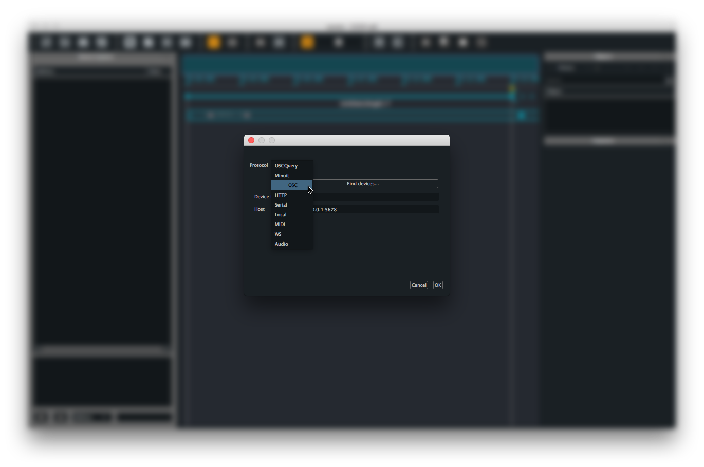
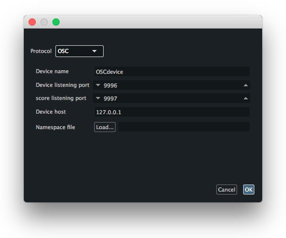
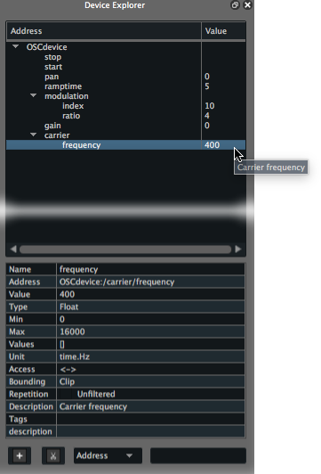

# How to setup an OSC device ?

To setup an Open Sound Control compatible device to be used with Score, click the `+` button at the bottom left of the *Device explorer* pane or use cmd + B (on MacOS) / ctrl + B (on Windows) shortcut. This prompts a configuration window where we can setup various protocols informations.

From the `Protocol` menu, select OSC. This brings the various option fields needed to setup the communication between your application and Score:

* A name for the device (used for display only)
* The network port your application will receive OSC messages from
* The network port Score will receive OSC messages from (assuming your application can echo back its parameters current state)
* IP address of the computer of your application is running on.

These setup up the communication between Score and your application.

> The setup of your OSC device can be adjusted at any time, by right-clicking on your device name in the Device explorer pane and choose `Edit` from the contextual menu.

When done, you may either:

* Load a namespace file from the device setup window that describes all the parameters of your application
* Use the `learn` function available when [right-clicking your device name in the Device explorer](../howtos/namespace_learning.html)
* [Manually declare the namespace in the Device explorer pane](../howtos/manual_namespace_setup.html)

