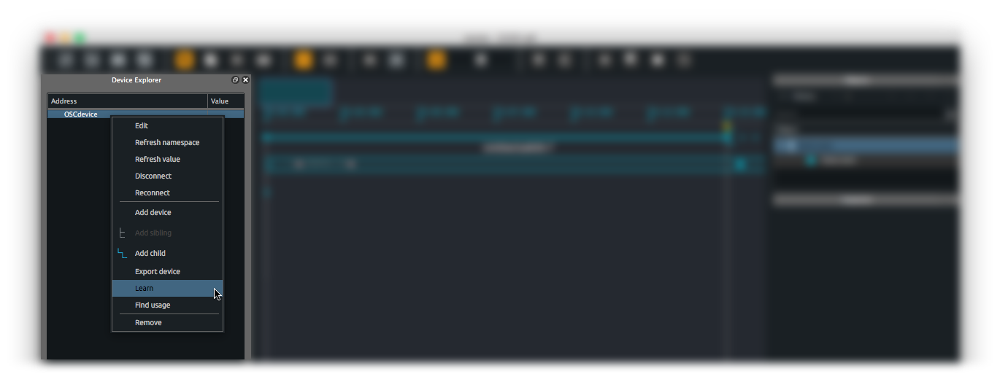

# How to use the learn function to build your application namespace ?

Once having [setup an OSC device](../howtos/declare_an_osc_device.html), you may want to use the Device explorer's learn feature to ease the declaration of all the parameter addresses of the application you want to control from Score. To do so, in the Device explorer, right-click on your device name then from the contextual menu, choose `learn`.

This brings a popup window displaying learnt parameters address. Assuming echoing of the parameters value is properly setup in your distant application, you may now start changing their value (ie. From the GUI) so they get sent back to Score. These should appear in Score's `OSC learning` window. 

When done in your distant application, press the return key or click the `Ok` button.

The Device explorer should now display all parameters from your device as a tree-like view.

## Editing parameters attributes

Using the learn function only set the namespace structure of your distant application. You may want to specify these parameters in order to benefit from Score parameter attributes-dependant features (ie. Automatic value range setup when writing automations, repetitions filtering, unit conversion).

To do so, in the Device explorer right-click on a parameter name of your device, then choose `Edit`. This bring a configuration window allowing to edit various attributes describing a parameter behaviour.

The attributes are the following:

* Parameter name
* Type of value
* Default value
* Domain (range)
* Clip mode
* I/O type
* Repetitions filter
* Optional tags
* Unit
* Description

Please see [libossia documentation page](https://ossia.github.io/#node-and-parameter-attributes) for detailed explanation on these attributes.