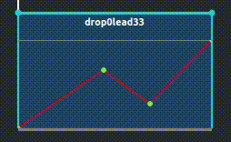
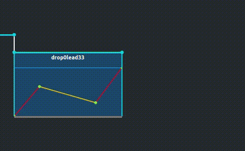
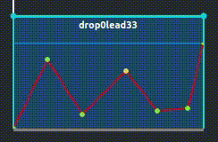

# Process overview : Automation

## Presentation

The automation is a central process in score.
It is a curve that represents the variation of the value of an address in time, bounded between a minimum and a maximum, with an optional unit.
It also allows tweening : instead of starting from a fixed point, it will query the current value of its address when executing, and adapt its first segment to start smoothly from this point.
This is useful for transitions and will be explained in further details afterwards.

[caption id="attachment_1071" align="alignnone" width="218"] A interval with a single automation[/caption]
Curve edition
Automations can have multiple break-points.
Between each break-point, in green, there are curve segments, in red.

New break-points can be added by pressing ⌘ (Mac) / Ctrl (Lin/Win) and clicking or simply double-clicking on the curve :

By default, the curvature of a segment can be modified by clicking on it, pressing Shift and moving the mouse vertically :

For now, this is only possible for the "Power" curve segment type ; this is the default type of a segment.

Other curve segments are available, including the common easing functions :

One can remove points of the automation by selecting them and pressing delete or backspace :

Finally, there are multiple edition modes :

The default mode locks the moved point between its two closest points.

Another mode ("unlocked") allows overwriting them :

It is also possible to just move the point without overwriting the adjacent points :

Automation inspector
When clicking on the parent interval of an automation (in the previous examples drop0lead33),
its inspector should become visible :

The fields are as follows :

 	Address : the address on which the automation will send messages.
Nodes of the device explorer can be dragged here.
It can be of the form :

 	aDevice:/anAddress : simple address
 	aDevice:/anAddress[1] : if the address is an array, will access the *second* value of the array (e.g. for [27, 12, 5], it will be 12)
 	aDevice:/anAddress[angle.radian] : if the address has an unit, will send the value in this unit. The value will be converted back to the address's original unit upon sending.

 	aDevice:/anAddress[color.rgb.r] : same as before, but for a specific component of an unit.

 	Tween : when checked, the automation will tween from the current value of the address.
The first curve segment will become dashed :

When playing, if the value of the address when the automation is reached is 50, then the first segment will interpolate from 50 to the value of the second point.
 	Min / max : the values between which the automation evolves.
The min is the value that will be sent if a point is at the bottom in the curve.
The max is the value that will be sent if a point is at the top in the curve.

Execution semantics
The automation tries to send values that are graphically as close as possible as the shown curve.
For the case where the address has no unit :

 	If the address is integer or floating point, the behavior is as expected.
 	If the address is a fixed-width array, then :

 	If there is no array accessor (such as an:/address[1]), all the values of the array are set to the value of the automation ([1, 1], [2, 2], [3, 3], etc.).
 	If there is an array accessor, only the accessed value will be set : [1, 1], [1, 2], [1, 3], etc...

For the case where the address has an unit, the value will be converted to the correct unit afterwards.

An interesting case is the cascading of units.
For instance, given this case :

First, the current value of aDevice:/light will be fetched, converted to the hue-saturation-value color space and its value will be set according to the first curve.
Then, in the red-green-blue color-space, the red component will be increased.
The result will be applied.