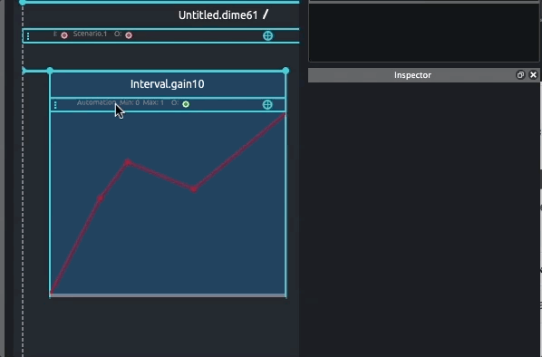

# Process overview: Automation

## Presentation

It is a curve that represents the variation of the value of an address in time, bounded between a *minimum* and a *maximum*, with an optional *unit*. It can also be used for tweening, that is ramping from a point defined during execution to a point value specified in the automation.

## Function edition
### Basic editing

Automations can have multiple break-points, between each are curve segments.

When adding an automation process, default function is an ascendant line going from the parameter minimal value or its value stored in the preceding state, to the maximum parameter value or its value stored in the consecutive state.

New break-points can be added by double clicking in the automation panel or using `cmd + click` (macOS) or `Ctrl + click (Windows).

By default, the curvature of a segment can be modified by selecting the segment to edit and using `shift + drag` to adjust curvature amount. Moving the mouse upward or downward will curve the segment in the corresponding direction.

> Note that adjusting the curvature of a segment is only available when using the default "Power" curve segment type

Points of the automation can be deleted by selecting them and pressing the `delete` or `backspace` key.

### Advance editing

The automation editor provides different options for point displacement. By default, moving a point horizontally is locked to the x position of the preceding and following point.

Point displacement can be unlocked from the function contextual menu. To do so, right click in the automation editor and uncheck the option: `Automation (float) > Lock between points`. When unlocked, moving a point beyond its preceding or following point will delete them.

Overwriting of the adjacent points can be prevented from by unchecking the option in the automation editor contextual menu: `Automation (float) > Suppress on overlap`.

## Function types

Other curve segments are available, including the common easing functions :

To set a function type, right click in the automation editor and select the desired type: `Automation (float) > Type`

## Tween mode

 Automation can be used in tween mode. To do so, from the automation Inspector, check the corresponding option. When checked, the automation will tween from the current value of the address.
 

> Notice that in tween mode, first curve segment will become dashed

When playing, if the value of the address when the automation is reached is 50, then the first segment will interpolate from 50 to the value of the second point.

## Related topic

* [Adding processes](../first_steps/first_scenario.md#writing-processes)
* [Addressing value](in_depth/value_addressing.md)
